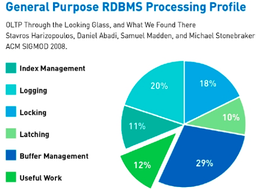

# Базы данных: краткое введение

## Зачем нужны базы данных

База данных (мы будем использовать сокращение БД) - совокупность информации, к которой можно легко получить доступ и модифицировать.

Для чего используются базы данных в бизнесе?

* хранение исторических данных
    * обучение моделей ML
    * ad-hoc анализ
    * управленческая отчётность
* обмен данными между приложениями (например, синхронизация информации между телефоном и телевизором)

Бизнес (особенно интернет-проекты) генерирует огромный объём информации.
Кажется, что если научится эффективно сохранять и использовать эти данные, можно повысить эффективность организации и увеличить прибыль.

## Форматы хранения данных

Для сохранения данных используются следующие форматы:
* бинарный: эффективное хранение, быстрое чтение с помощью специального программного обеспечения - например, формат pickle
* текстовый: XML, csv, json: занимают много места при хранении, зато человеко-читаемы

Поговорим подробнее о текстовых форматах данных

### XML

XML (eXtensible Markup Language) — [расширяемый язык разметки](https://ru.wikipedia.org/wiki/XML) текстовых документов. Организация Консорциум Всемирной паутины (W3C) занимается разработкой [стандарта XML](https://www.w3.org/XML/)

Пример документа в формате XML:
<pre> 
<code>
&lt; ?xml version="1.0" ?&gt;
&lt; contentTitles reminder="15"&gt;
    &lt; content &gt;
        &lt; releaseDate &gt; 1181251680 &lt; /releaseDate &gt;
        &lt; id &gt; 040000008200E000 &lt; /id &gt;
    &lt; /content &gt;
&lt; /contentTitles &gt;
</code>
</pre>

Видно, что файл содержит версионирование ```xml_version="1.0"```, а так же имеет иерархическую структуру.
Минимальный логический элемент XML называется **сущностью** (англ. entity).
У *сущности* есть имя (тест, заключённый в угловые скобки) и значение (англ. **value**) - всё, что содержится внутри сущности.
Одним из подмножеств XML является язык разметки web-страниц *HTML*. 
Сущности HTML зафиксированы в стандарте html, а сущности XML нигде не зафиксированы - их определяет для себя разработчик в каждом конкретном случае.
XML-документ выше описывает некоторые свойства контента а базе данных онлайн-кинотеатра: например дату выпуска *releaseDate* и внутренний идентификатор *id*)


### CSV

CSV (Comma Separated Values) - это текстовый формат хранения данных, где каждая строка представляет собой объект.
Внутри строки хранятся *атрибуты* объекта, разделённые запятыми. В каждой строке должно быть одинаковое количество атрибутов, иначе CSV считается невалидным.
Ниже приведён пример CSV-файла, в первой строке хранятся названия атрибутов

<pre>
'Код', 'Тема', 'Компонент', 'Затрачено в часах'
'HYDRA-534', 'Гибридный рекомендатель с multi-channel feedback', 'hydra', '3'
'HYDRA-532', 'Джоба в дженкинсе для расчёта динамики РВП', 'hydramatrices', '2'
'HYDRA-531', 'Интеграция Hydra с Gamora', 'hydramagrices', '4'
'HYDRA-530', 'Тестируем интеграцию с Jira', 'hydra', '2'
'HYDRA-524', 'Оптимизировать матрицу ItemFactors', 'hydra', '2'
'HYDRA-520', 'Закостылить параметр top', 'hydra', '2'
</pre>

В отличие от `XML` формат `csv` требует меньше объема для передачи одинакового объёма информации.
За экономию на объёме данных мы расплачиваемся снижением гибкости - каждая строка обязана хранить одинаковое количество атрибутов, а если атрибут у объекта отсутствует приходится использовать "пустое"  значение - например, NULL.

### JSON

JSON (англ. JavaScript Object Notation) — текстовый формат обмена данными, основанный на JavaScript. 

JSON представляет собой последовательность пар атрибут-значение, ограниченных фигурными скобками, например: 

<pre>
{"firstName": "Ivan", "lastName": "Ivanov", "age": 30}
{"firstName": "Vladimir", "mail": "v.putin@mail.ru"}
</pre>

Этот JSON-файл содержит два объекта, которые описывают профили пользователей
В первом объекте, мы видим, например, что ключу `"firstName"` соответствует значение `"Ivan"`. Обратите внимание, что у первого и второго объекта разный набор атрибутов - это основное отличие JSON от CSV

Достоинства JSON

* легко читается людьми
* занимает меньше места в текстовом виде, чем аналогичный объект в формате XML
* является "родным" форматом для Javascript, Python, MongoDB и других систем

В силу этих особенностей, этот формат стал стандартом для передачи текстовой информации в сети интернет.
Использование JSON позволяет хранить объекты с разным количеством атрибутов (как в XML) и делать это экономично по памяти (как csv). 

В стандартный набор библиотек Python входит модуль `json`, который используется для преобразования объектов (например, словарей) в текстовый JSON формат.

# Базы данных: обзор решений

Мы знаем, что есть различные текстовые форматы для хранения данных. Однако, кроме хранения информации её хотелось бы как-то обрабатывать - строить отчёты, применять к ней модели машинного обучения и т.д.
Для целей более эффективного хранения и обработки информации разработаны специальные программные продукты - системы управления базами данных, СУБД.

Концептуально СУБД состоят из двух слоёв: логический слой и внутренний (физический) слой
* логический слой содержит бизнес-логику доменной области (например, онлайн-кинотеатр)
* внутренний слой это работа с сетью, процессами ФС, памятью, уровнями доступа и т.д.

На логическом уровне существует разделение баз данных на реляционные БД (SQL) и нереляционные (их принято называть not only SQL ли коротко NO-SQL)

* реляционные БД хранят структурированные данные (в таблицах вроде csv) и отвечают ACID (Atomicity, Consistency, Isolation, Durability — атомарность, непротиворечивость, изолированность, долговечность). Примеры: MySQL, Postgres.
* Нереляционные (NotOnly SQL DB) хранят объекты с произвольным набором атрибутов - например, нет ограничений на типы данных и кол-во полей. Примеры: MongoDB, CouchDB, Redis.

Для работы с реляционными базами данных (где вся информация разложена по таблицам) используется язык SQL (structured query language) — «язык структурированных запросов»)
Это декларативный язык программирования, применяемый для создания, модификации и управления данными - он появился в в Появился в 1972 и до сих пор реляционные СУБД используют либо SQL.

Что такое ACID? Это набор требований к СУБД как к программному продукту

* Atomicity: никакая транзакция не будет зафиксирована в системе частично. Будут либо выполнены все её подоперации, либо не выполнено ни одной. Если изменения транзакции не фиксируются (commit), то откатываются (rollback)
* Consistency: успешная транзакция сохраняет согласованность базы данных (на всех репликах одна и та же версия данных). Сохраняются допустимые значения полей, внешние ключи и т.д.
* Isolation:  параллельные транзакции не должны оказывать влияние друг на друга (существуют различные уровни изоляции)
* Durability: результаты транзакции должны остаться сохранёнными после возвращения системы в работу

Подробнее про ACID [почитать тут](https://habr.com/ru/post/208400/). О том, почему ACID нарушается в NO SQL есть хорошая [статья на Хабре](https://habr.com/ru/post/228327/)
Дополнительно можно почитать интересную статью про No SQL с [точки зрения разработчика](http://spring-projects.ru/understanding/nosql/)

Реляционные (SQL) СУБД гарантируют ACID и являются очень сложными программными продуктами. Если заглянуть "под капот" такого продукта и проверить, куда тратятся системыне ресурсы, мы увидим следующую диаграмму:



То есть большая часть ресурсов тратится не на выполнение SQL, на поддержание "качества" данных.

Со временем стало очевидно, что ACID-модель критична только для некоторых кейсов - например, в банковских приложениях (тут согласованность данных продиктована самой бизнес-задачей).
Но есть и другие задачи, где согласованность не так важна - построение отчётности, кеширование данных и т.д.
К тому же объёмы данных стали очень быстро расти и оказалось что ACID СУБД (почти) не поддаются масштабированию (о шардировании и репликации мы поговорим позднее в этом курсе).
Преодолеть эти недостатки реляционных СУБД были призваны NO SQL БД

За счёт отказа от ACID проблемы с масштабированием были частично решены.
Из недостатков можно упомянуть CAP-теорему: невозможно одновременно обеспечить Consistency (непротиворечивость), Availability (доступность) и Partition Tolerance (устойчивость к разделению) одновременно.

## Краткий обзор СУБД

### Реляционные СУБД

* Microsoft SQL Server, Oracle Database - монстры энтерпрайза
* MySQL и PostgreSQL - аналоги с открытым кодом
* MariaDB - форк MySQL

**Преимущества:** транзакционность, поддерживают ACID

**Недостатки:** сложность масштабирования

### NoSQL базы данных

Нереляционные СУБД делятся документо-ориентированные (col) и ключ-значение (key-value)

* MongoDB (doc) - вложенные документы, которые выглядят как JSON
* CouchDB (doc) - как Mongo, но на Erlang
* Tarantool (key-value) - быстро, но не для любых данных 
* Memcache, Redis (key-value) - распределённый кеш

### Big data

Иногда данных настолько много (терабайты), что нам не критичен быстрый доступ к ним - хочется просто хранить их и иногда строить аналитику.
В этом случае нет необходимости хранить эти бешеные объёмы на одном сервере - можно использовать для хранения и обработки информации распределённую ФС Hadoop Distributed File System, HDFS. 

Поверх HDFS тоже строят СУБД, например

* Hive - есть SQL. Медленно, но надёжно.
* Pig - свой процедурный язык, похожий MapReduce.
* Impala, Presto - не используют Hadoop для вычислений, только возможность HDFS.

### Колоночные (аналитические) СУБД

В классических (реляционных) СУБД данные хранятся по строкам.
Однако, если СУБД используется для аналитики (построения отчётов) то над данными часто производится операция группировки - когда данные в одном столбце группируются по ключу из другого столбца.
Такой кейс позволяет хранить данные "по колонкам" - то есть таблица вместо набора строки превращается в набор колонок таким образом, чтобы можно было быстро считать агрегаты. 

* Cassandra
* Vertica - коммерческое решение с высокой стоимостью
* Clickhouse - open-source продукт с большим сообществом, детиище Yandex

# Базы данных: внутреннее устройство 

## Программные компоненты СУБД

Мы знаем, что СУБД состоят из логического уровня и физического. В этом разделе поговорим о механизмах физического уровня.


Как видно из схемы, на физическом уровне решается очень много различных задач, реализации этих задач очень сильно отличаются между разными СУБД, но концептуально можно выделить ряд общих компонент

* диспетчер запросов
    * парсер
    * оптимизатор
* диспетчер данных
    * доступ файлам БД для конкурирующих процессов
    * кеширование данных в памяти
* инструменты администрирования
    * мониторинг нагрузки
    * бекапы
* вспомогательные компоненты
    * диспетчеры ФС
    * диспетчер памяти
    * диспетчер сети
    * etc
    
Если есть желание более тесно познакомиться с тем, как работают БД, можно [заглянуть на Хабр в блог Mail.ru](https://habr.com/company/mailru/blog/266811/)

## Алгоритмическая "начинка"

Для эффективной работы СУБД использует полезные алгоритмы и эвристики - индексы, служебные статистики

### Индексы БД

Индекс - отсортированный набор значений столбца, он позволяет ускорить сортировку и выборку записей из таблиц.
Структура данных для хранения индекса - [B-дерево](https://ru.wikipedia.org/wiki/B-дерево ).

Создание и хранение индексов - дополнительная нагрузка на БД, зато получаем выигрыш в скорости. Нельзя навесить индекс на все поля, потому что каждая запись в такую таблицу будет приводить к повышенному использованию ресурсов диска

Индексы бывают обычными (когда индекс хранит ссылки на истинные значения) и кластерными (индекс упорядочивает сами значения в таблице).

Индексы помогают избежать сканирования таблицы (full scan) во время выборки данных (`SELECT`).

О том, как работают индексы можно почитать [тут](https://ruhighload.com/Индексы+в+mysql ).

### Служебная информация

* статистика данных: min, max, std
* информация об индексах
* счётчик строк
* счётчик блоков по 4 (8) кб
* квантили и гистограммы по колонкам

Статистика используется в оптимизаторе SQL и позволяет более эффективно строить запросы

### Оптимизация запросов

СУБД используют cost-based оптимизацию.
Запрос разбивается на последовательность операций, затем из всех цепочек выбирается та, что с наименьшей стоимостью.

Алгоритмы обычно жадные поэтому найденное решение не является оптимальным в глобальном смысле 

О том, как работает оптимизация в Postgres [можно почитать на Хабре](https://habr.com/ru/post/203320/)