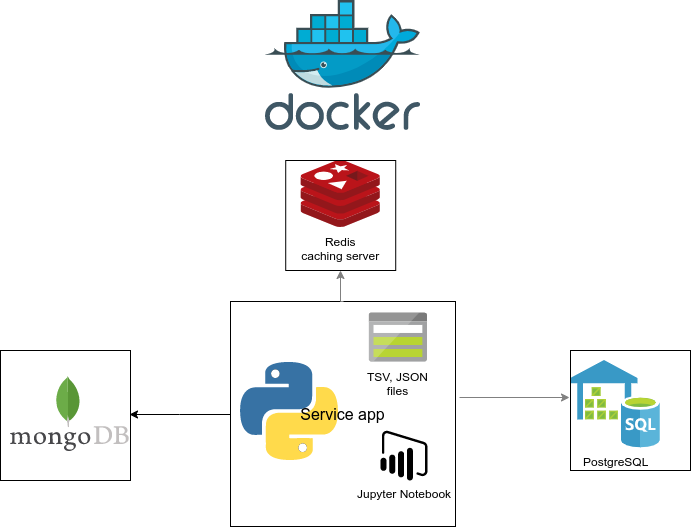

# Подготовка машины к работе

# Урок 1. Базовая настройка рабочей среды

Занятия будут проходить в ОС Ubuntu 18.04 LTS. Установка необходимых баз данных (Mongo, Postgres, Redis, etc.)
осуществляется с помощью утилиты виртуализации Docker. Можно установить пакеты прямо в систему Ubuntu. Доступны оба варианта, но докер более предпочтителен.

**Примечание:** Если у Вас MacOS - сойдёт, она похожа на Ubuntu и утилиты командной строки там примерно такие же.
Если у Вас Windows, то будет сложнее, но в целом тоже не критично - главное, чтобы было куда установить Postgres (обязательно!) и остальные дистрибутивы (Mongo, Redis - опционально). 

## Установка и настройка операционной системы Ubuntu

Ввесь курс можно проходить и без Ubuntu (или MacOS), но с трудностями винды придётся разбираться при помощи коллег и интернетов, спикер курса не поможет.
Если ОС Ubuntu не является основной операционной системой, то можно установить её следующими способами 

* предпочтительно: с помощью облачного сервиса Google Cloud [по этой инструкции](#ubuntu-google-cloud) или любого другого, например Яндекс.Облако.
* С помощью VirtualBox [по этой инструкции](http://profitraders.com/Ubuntu/VirtualBoxUbuntuInstall.html)
* с помощью ПО VMWare [по этой инструкции](https://www.quora.com/How-do-I-install-Ubuntu-using-VMware-on-Windows-10) или VirtualBox

После того, как убунта установлена (любым способом), нужно обновить список пакетов. Для этого запустим в консоли команду:

<pre>
sudo apt-get update && sudo apt-get -y upgrade;
</pre>

Эта команда обновит пакетный менеджер apt-get. После этого установить менеджер пакетов pip и вспомогательные утилиты (unzip, git):

<pre>
sudo apt-get install python-pip unzip git;
</pre>

Пакет pip - это менеджер пакетов python, его помощью можно будет устанавливать python библиотеки. Утилита unzip - программа для распаковки архивов.

Мы установили git не просто так - он нужен для того, чтобы скопировать учебный репозиторий с кодом этого курса.
Теперь скачиваем репозиторий курса - там хранятся материалы для домашних работ.

<pre>
git clone https://github.com/adzhumurat/data_management.git
</pre>

В рапозитории вы найдёте файл `data_management/data_store/movies_data.zip`, в котором хранятся `csv` и `json` файлы.
Для работы вам нужно извлечь эти файлы в директорию `data_management/data_store/raw_data` чтобы это сделать запустите команду `python3 data_tools/extract_zipped_data.py -s extract`

Чтобы проверить, как применились изменения выполним в консоли команду 
<pre>
ls data_store/raw_data
</pre>

Результат работы команды - должны увидеть в список файлов, которые только что распаковали
<pre>
dogs.json  links.csv  movies_metadata.csv  ratings.csv  tags.json
</pre> 

**Справка** команда *ls* "печатает" список файлов в директории, которая хранится в переменной среды *$SOURCE_DATA*, где значок *$* является служебным.

**Справка** для работы в консоли будем использовать базовые команды Linux

* Команда *sudo* позволяет запустить другие команды с правами Администратора системы
* Команда *mkdir* создаёт пустую директорию
* Команда *ls* печатает список файлов, которые находятся в директории.
* Команда *chmod 777* разрешает cоздание и удаление файлов из директории *$SOURCE_DATA* всем пользователям без исключения
* Команда *cd* позволяет сменить директорию.

## Работа с Docker

Для установки системы виртуализации Docker на официальном сайте есть прекрасные пошаговые инструкции для всех основных ОС

* [тут Linux](https://docs.docker.com/install/linux/docker-ce/ubuntu/)
* [тут MacOS](https://docs.docker.com/docker-for-mac/install/)
* [тут Windows](https://docs.docker.com/docker-for-windows/install/)

Если у Windows, то для установки нужно использовать вот эту инструкцию:  https://docs.docker.com/toolbox/toolbox_install_windows/ 

Установим docker, согласно [инструкции для Ubuntu](https://docs.docker.com/install/linux/docker-ce/ubuntu/).
Проверьте, что всё работает с помощью запуска команды
<pre>
docker run hello-world
</pre>

Если увидите ответное приветствие от Docker - готово, вы великолепны! Если не работает без sudo - продолжайте настройку по инструкции.
Кроме докера поставим docker-compose

<pre>
sudo apt-get install docker-compose
</pre>

Подготовка завершена! Один раз проделав этот пункт, можно к нему больше не возвращаться.

## Автоматизируем работу с Docker

Мы будем пользоваться СУБД Postgres и MongoDB, которые развернём в docker.
Для подробного знакомства с `docker` рекомендую пройти [мини-курс](https://github.com/adzhumurat/workshop_docker_beginner), по желанию.

### Автоматизация разворачивания среды с помощью docker-compose

Мы используем данные [The Movies Dataset](https://www.kaggle.com/rounakbanik/the-movies-dataset) c Kaggle - нужно стартовать среду, куда зальём "сырые" csv файлы с Kaggle.

* Проверьте директорию `data_store/pg_data` - она должна быть пустой
* запустите сборку контейнера для питоновского приложения с помощью команды `python3 docker_compose/upstart.py -s docker`
* с помощью команды `docker images | grep service-app` убедитесь, что был создан образ с именеи `data-mng_service-app`
* на всякий случай удалите все контейнеры, которые вы уже назапускали `docker rm -f $(docker container ls -q)`
* запустите загрузку данных в Postgres `python3 upstart.py -s load`. Загрузка выполняется [скрипт для загрузки данных load_data.sh](../docker_compose/data_client/app/load_data.sh)  `docker-entrypint.sh`
* проверьте что данные в контейнер успешно загружены `python3 docker_compose/upstart.py -s test`
* Чтобы запустить python сервис запустите сборку python окружения `python3 docker_compose/upstart.py -s pipenv`

### Запуск MongoDB

Монга будет запущена автоматически (т.к. мы пользуемся docker-compose) - это можно убедится, выполнив команду `docker ps | grep mongo`. Нужно только проверить её работоспособность MongoDB, залив туда данные. 

* запускаем импорт документов ` python3 docker_compose/upstart.py -s mongoimport` 
* стартуем mongo `python3 docker_compose/upstart.py -s mongo`

В консоли увидим информацию об успешном запуске
<pre>
MongoDB shell version v3.6.3
connecting to: mongodb://mongo_host:27017/test
MongoDB server version: 4.1.6
</pre>

Если добрались до этого шага - поздравляю!
Вы только что развернули среду для исполнения приложений, которая включает в себя 4 узла, представленных на схеме

* `service_app` наш "центральный" узел, на который установлен Python, т.н. точка входа, через которую будем общаться с остальными узлами.
* `postgres_host` узел с *реляционной* СУБД **Postgres**, где мы будем исполнять SQL запросы
* `mongo_host` узел с *NoSQL* СУБД **MongoDB**
* `redis_host` узел с *key-value* СУБД **Redis** (будет использоваться как кеширующий сервер)

В течении курса мы поработаем с каждой из этих современных систем хранения данных.

### Бонус: работа jupyter notebook

Jupyter - это удобная визуальная среда для запуска Python приложений.

Чтобы собрать питоновское окружение с jupyter на борту, выполните команду

<pre>
python3 docker_compose/upstart.py -s pipenv
</pre> 

Затем запустите команду старта jupyter ноутбука

<pre>
python3 docker_compose/upstart.py -s jupyter
</pre>

В консоли появится информация о запуке Юпитера
<pre>
[I 08:20:16.950 NotebookApp] Use Control-C to stop this server and shut down all kernels (twice to skip confirmation).
[C 08:20:16.950 NotebookApp] 
   
    Copy/paste this URL into your browser when you connect for the first time,
    to login with a token:
        http://0.0.0.0:8888/?token=029e0ce949f5e7cad2d8be93f982f6f5fddb76c81df0353c
</pre>

Ссылку `http://0.0.0.0:8888/?token=029e0ce949f5e7cad2d8be93f982f6f5fddb76c81df0353c` нужно открыть в браузере и насладиться интерфейсом Jupyter.

## Решение проблем с docker

Чтобы "погасить" весь бэкенд, запустите команду
<pre>
python3 docker_compose/upstart.py -s down
</pre>

Если контейнер не стартует с ошибкой
<pre>
docker: Error response from daemon: Conflict. The container name "/some-postgres" is already in use by container "2a99cb6629b78e7b5b6747a9bd453263940127909d91c8517e9ee0b230e60768". You have to remove (or rename) that container to be able to reuse that name.
</pre>

То надо бы остановить все запущенные докер-контейнеры и удалить их

<pre>
sudo docker stop $(sudo docker ps -a -q)
sudo docker rm $(sudo docker ps -a -q)
</pre>

Удаление всех образов
<pre>
docker rmi $(docker images -q)
</pre>

# Ubuntu Google Cloud

Как установить - по инструкции отсюда: https://cloud.google.com/compute/docs/quickstart-linux

Внимание! В инструкции установка Debian, а нам нужна Ubuntu 18.04. Эта опция выбирается в меню Boot Disk

После установки ваш инстанс можно будет найти на этой странице https://console.cloud.google.com/compute/instances

# Что мне делать дальше?

Дальше можно переходить к экспериментам! Начните с [простых запросов SQL](./sql_language.md)